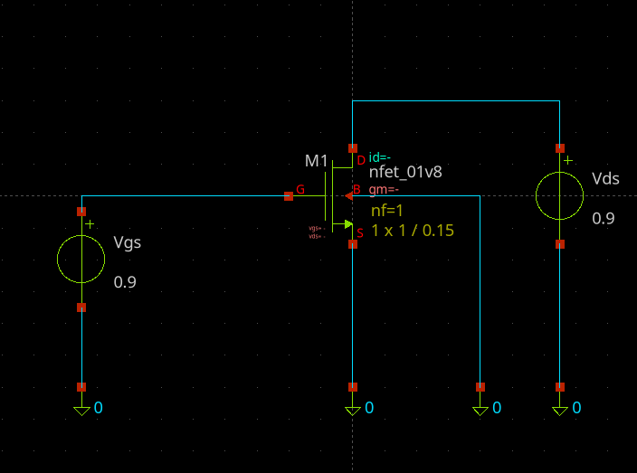
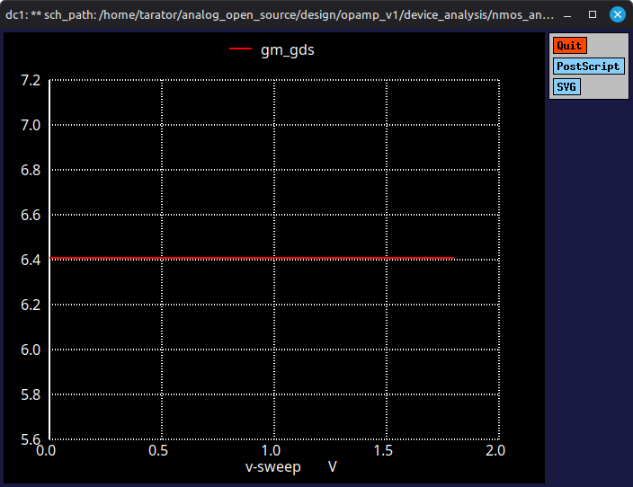
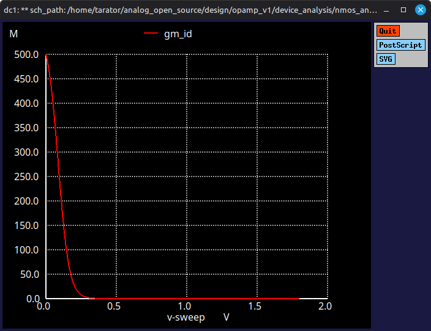
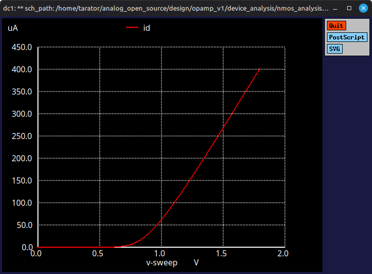
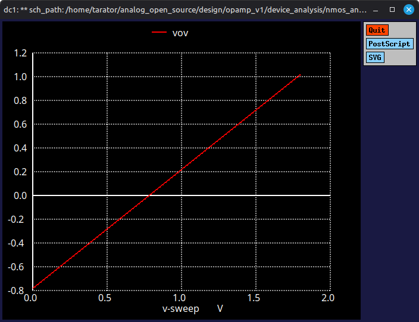

## NMOS


### Op
```SPICE
** sch_path: /home/tarator/analog_open_source/design/opamp_v1/device_analysis/nmos_analysis.sch
**.subckt nmos_analysis
XM1 net2 net1 0 0 sky130_fd_pr__nfet_01v8 L=0.15 W=1 nf=1 ad=0.29 as=0.29 pd=2.58 ps=2.58 nrd=0.29 nrs=0.29 sa=0 sb=0 sd=0 mult=1
Vds net2 0 0.9
Vgs net1 0 0.9
**** begin user architecture code
.lib /usr/local/share/pdk/sky130B/libs.tech/combined/sky130.lib.spice tt

.op
.save all

.control
run

print v(net1)
print v(net2)
print -i(Vds)/1u
print @m.xm1.msky130_fd_pr__nfet_01v8[gm]
print @m.xm1.msky130_fd_pr__nfet_01v8[gds]
print @m.xm1.msky130_fd_pr__nfet_01v8[vth]

.endc

**** end user architecture code
**.ends
.end

```

```results:
Circuit: ** sch_path: /home/tarator/analog_open_source/design/opamp_v1/device_analysis/nmos_analysis.sch

Doing analysis at TEMP = 27.000000 and TNOM = 27.000000

 Reference value :  0.00000e+00
No. of Data Rows : 1
v(net1) = 9.000000e-01
v(net2) = 9.000000e-01
-i(vds)/1u = 3.200417e+01
@m.xm1.msky130_fd_pr__nfet_01v8[gm] = 2.730476e-04
@m.xm1.msky130_fd_pr__nfet_01v8[gds] = 1.587770e-05
@m.xm1.msky130_fd_pr__nfet_01v8[vth] = 7.703644e-01
Doing analysis at TEMP = 27.000000 and TNOM = 27.000000
```

### DC (Vgs sweep)





## NMOS diff input için analiz
### L=0.15u:
- v(net1) = 9.000000e-01  
- v(net2) = 9.000000e-01
- id_w = 3.200417e+01
- gm_id = 8.531627e+00
- gm_gds = 1.719693e+01
- vov = 1.296356e-01

### L=0.30u:
- v(net1) = 9.000000e-01
- v(net2) = 9.000000e-01
- id_w = 2.233564e+01
- gm_id = 7.531183e+00
- gm_gds = 5.309613e+01
- vov = 2.220404e-01

### L=0.50u:
- v(net1) = 9.000000e-01
- v(net2) = 9.000000e-01
- id_w = 1.659027e+01
- gm_id = 6.992467e+00
- gm_gds = 7.268811e+01
- vov = 2.615701e-01

### L=1.00u:
- v(net1) = 9.000000e-01
- v(net2) = 9.000000e-01
- id_w = 1.094909e+01
- gm_id = 6.178036e+00
- gm_gds = 8.161602e+01
- vov = 2.843709e-01
