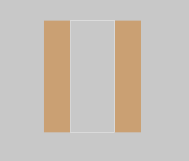
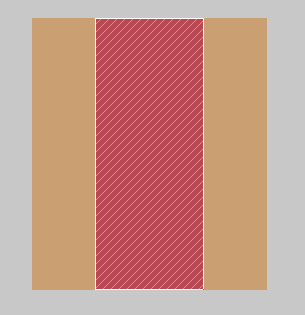
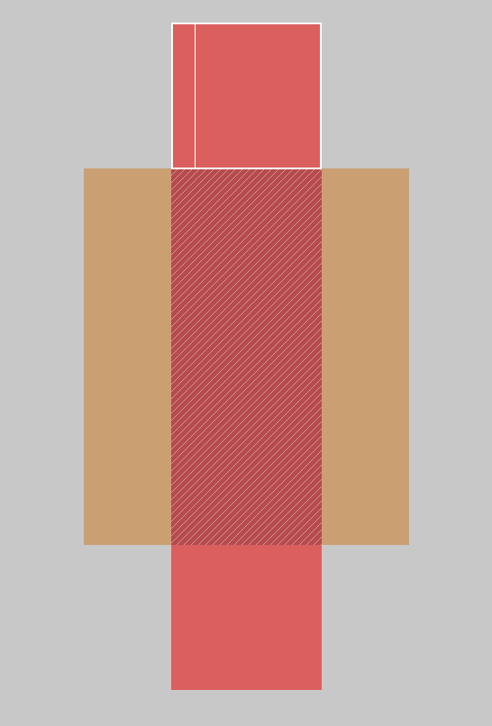
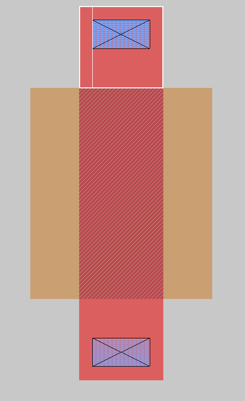
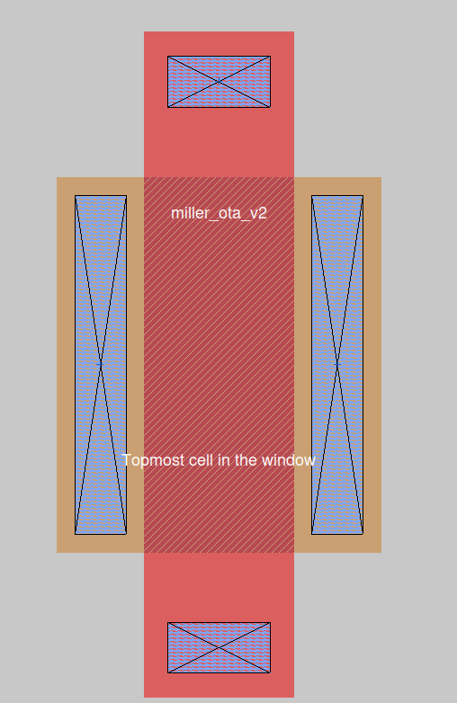
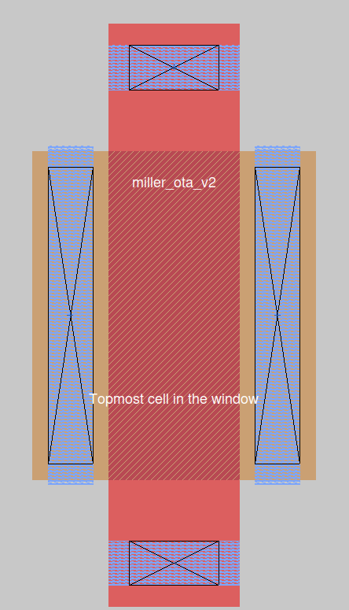
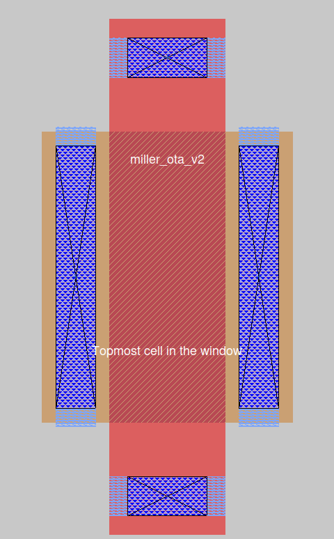
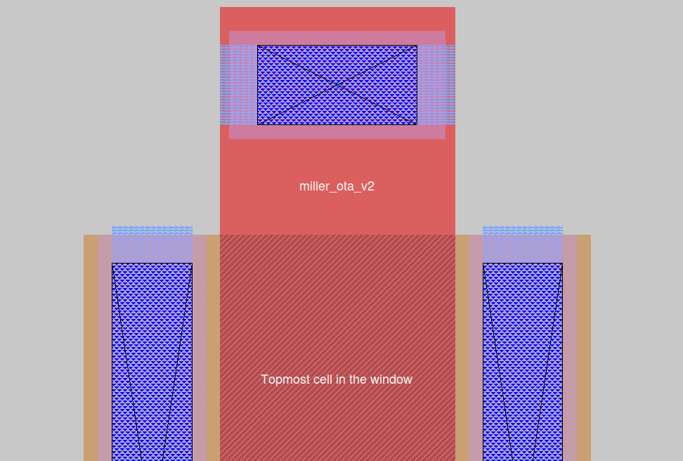
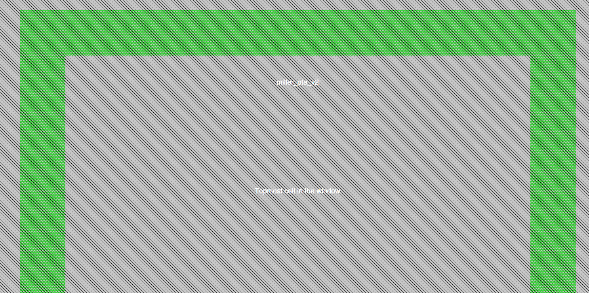
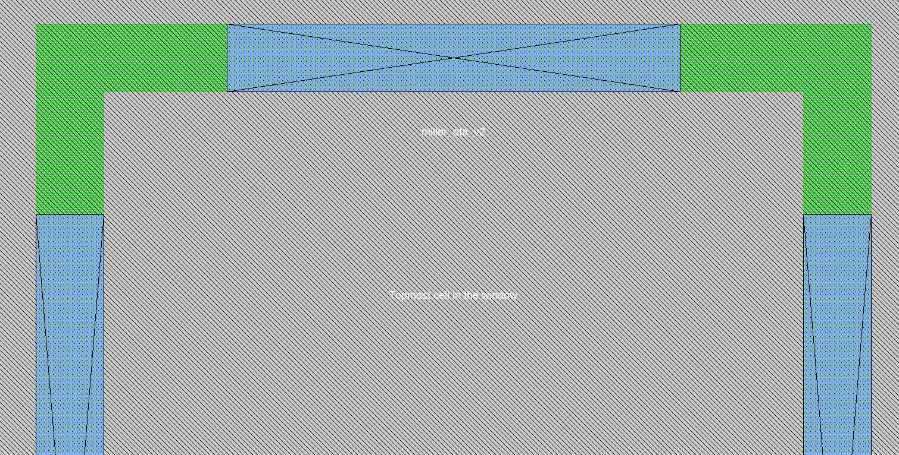

RVT / standard NMOS:  
ndiff + nsdm + poly crossing  

LVT NMOS:  
ndiff + nsdm + poly crossing + lvtn marker  

### pmos lvt  
* W: 1.25um, L=0.5um

1. öncelikle pdiffusion bulunur.  

 
2. ptranstistor ile transistor alanı oluşturulur.  

3. poly silicon extension bunulur.  

4. poly contant(pc) ile polysilicon <> locali bağlantısı yapılır.  

5. pdiffusion contact(pdc) ile diffusion <> locali bağlantısı sağlanır.

6. locali ile gate, source drain contactları local interconenct seviyesine çıkarılır.  

7. viali: locali katmanından bir üst metal katmana geçmek için kullanılır.  
   viali genellikle pdc, pc ile aynı boyutta tutulur.  

8. metal1 ile tüm contact'lar metal1 seviyesine bağlanır.  

### nwell bulk
1. nwell yerleştirilir.
2. nsub_ndiff yerleştirilir. ve bu sayede nwell içinde n kuyusu açılır.

3. ndiff_ncontact, ile ndiffusion locali'ye bağlanır.  ndiffusion <> locali

4. locali katı

5. metal katı otomatik gelmezz!
