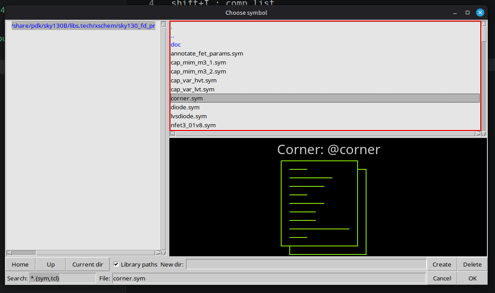
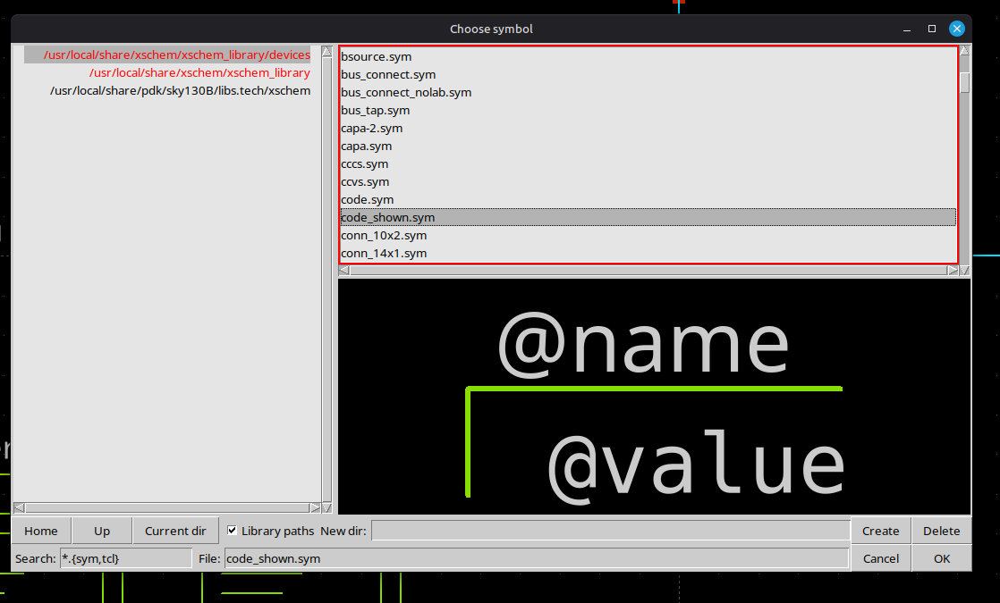
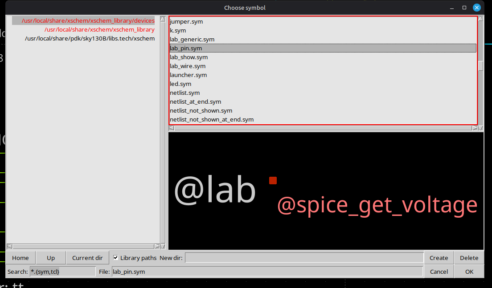
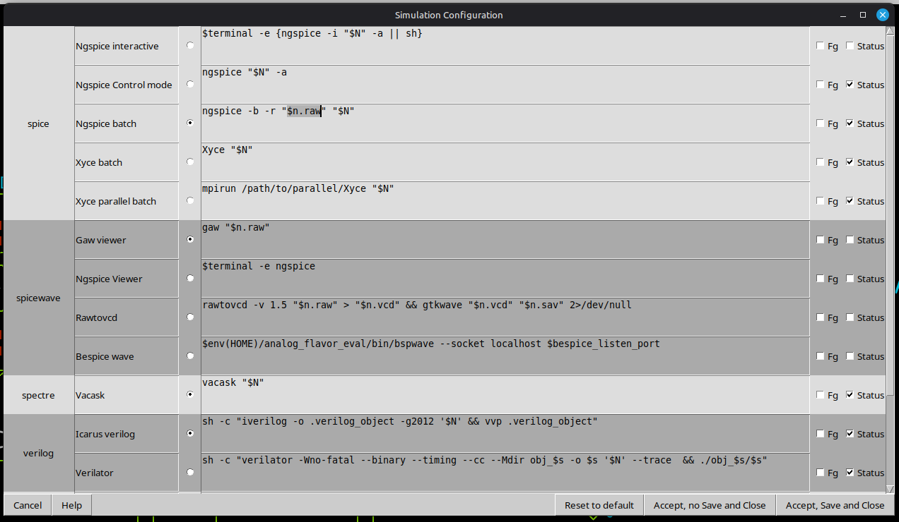
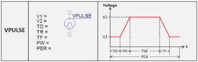

Notes ~  12.04.2026  

## xschem başlatma
```bash
cd xschem # change dir
echo 'source /usr/local/share/pdk/sky130B/libs.tech/xschem/xschemrc' > ./xschemrc # copy xschem confg (one time)
xschem & # start xschem (every time)
```


## Shortcuts:
[http://repo.hu/projects/xschem/xschem_man/commands.html](http://repo.hu/projects/xschem/xschem_man/commands.html)
### xschem  
- shift+I : comp list
- point then w: wire
- select then c: copy
- select then m: move
- select then shift+R : rotate
- l : symbol çizerken line çizmek için

1x1/0.15
* 1 : multiply
* 1 : width
* 0.15 : length

xschem comp lis: /usr/local/xschem/xschem_library/devices
comp list: /user/local/share/pdk/sky130B/libs.tech/xschem

For corner model:

comp list>sky130_fd_pr>corner.sym

For spice code:

xschem comp list > code_shown.sym

For pin:

xschem comp list > lab_pin

### sim configuration

Simualtion > Configure Simulators and Tools

Bu ayar ile birlikte spice netlist ve ngspice save dosyası şematik dosyasının yanındaki simulation/şema adı klasörüne kaydedilecektir.
```
Simulation > Use 'simulation/[schname]' dir in schematic dir.
```

### Symbol üretmek
Symbol > make symbol from schematic  
ardında sym dosyasını aç  
ve düzenle.

- Pinler için;  
    Alt+P ile ekle; double click:
    içinde yazması gereken örnek: "name=A dir=in"
- sembol çizgileri için "Tools sekmesini" kullan
  kısayol için; l:line, ctrl+shift+c: circle; t: text
- text ekleyerek; @symname, @name gibi etiketler kullanılabilir.

### spice komutları
#### Pulse:  
General form:
```
PULSE(V1 V2 TD TR TF PW PER NP)
```
Examples:

```
VIN 3 0 PULSE(-1 1 2NS 2NS 2NS 50NS 100NS 5)
```


| Name | Parameter | Default Value | Units |
| --- | --- | --- | --- |
| V1 | Initial value | - | V , A
| V2 | Pulsed value | - | V , A
| TD | Delay time | 0.0 | sec
| TR | Rise time | TSTEP | sec
| TF | Fall time | TSTEP | sec
| PW | Pulse width | TSTOP | sec
| PER | Period | TSTOP | sec
| NP | Number of Pulses *) | unlimited | -

## ylimit
```bash
plot rr1#branch rr2#branch ylimit 7 17
```

## Skywater Notları
[https://skywater-pdk.readthedocs.io/en/main](https://skywater-pdk.readthedocs.io/en/main)

### Background

SKY130 is a mature 180nm-130nm hybrid technology developed by Cypress Semiconductor that has been used for many production parts. SKY130 is now available as a foundry technology through SkyWater Technology Foundry.

The technology is the 8th generation SONOS technology node (130nm).

The technology stack consists of;

- 5 levels of metal (`p` - penta)
- Inductor or Inductor-Capable (`i`)
- Poly resistor (`r`)
- SONOS shrunken cell (`s`)
- Supports 10V regulated supply (`10R`)


